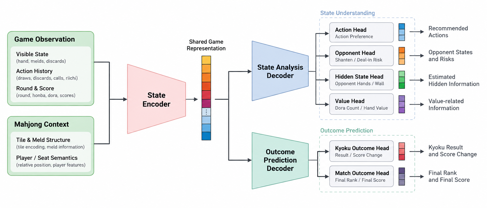

# Riichi Analysis Engine

<p align="center">
  
</p>

### [中文](#中文) | [日本語](#日本語) | [English](#english)

---

## 中文

### Riichi Analysis Engine

一个面向立直麻将研究与分析的多任务引擎，兼容 [Riichi Engine Protocol](https://github.com/SiyeW/riichi-engine-protocol)。

项目尝试使用同一个模型，从牌局中的可见信息出发，同时完成动作推荐、对手状态分析、隐藏信息估计和牌局结果预测等任务，为牌谱研究和外部麻将程序提供统一的分析能力。

> 项目仍处于开发和实验阶段。模型结构、训练方法、协议接口和输出格式仍可能调整。

### 主要能力

Riichi Analysis Engine 目前围绕以下几类任务进行开发：

| 类别 | 输出 |
| --- | --- |
| 决策分析 | 当前局面的动作推荐 |
| 对手分析 | 对手向听状态、牌张放铳风险 |
| 隐藏信息估计 | 对手暗牌、剩余牌山 |
| 手牌价值分析 | 对手宝牌数量与打点相关预测 |
| 小局预测 | 小局结果与分数收支 |
| 全局预测 | 最终顺位与终局分数 |

这些任务由同一个模型共同完成，使不同分析目标能够共享对牌局状态、玩家行为和隐藏信息的表示。

### 项目定位

立直麻将是一种不完全信息游戏。对于牌谱分析而言，仅判断“当前应该打什么”并不能完整描述牌局。

Riichi Analysis Engine 希望进一步分析例如：

- 对手目前更可能处于什么向听状态？
- 某张牌对不同对手分别具有多大的放铳风险？
- 根据已经公开的舍牌、副露、立直等信息，对手可能持有哪些牌？
- 当前公开信息下，剩余牌山可能呈现怎样的分布？
- 当前小局更可能以怎样的方式结束？
- 局部状态和结果最终会如何影响整场对局的顺位与得点？

因此，本项目并不只将模型视为一个麻将策略网络，而是尝试构建一个能够同时描述**决策、对手、隐藏状态和结果**的统一分析模型。

更具体的输入表示、模型结构、输出头和训练接口见[模型文档](docs/model.zh-CN.md)。

### 与 Riichi Mahjong Studio 的关系

[Riichi Mahjong Studio](https://github.com/SiyeW/riichi-mahjong-studio) 是一个用于立直麻将牌谱复盘、研究和对局练习的桌面程序，并支持通过 Riichi Engine Protocol 加载外部分析引擎。

Riichi Analysis Engine 计划作为其中可选的分析引擎之一，为研究和分析提供动作推荐、对手分析、隐藏信息估计和结果预测等能力。

两个项目彼此独立：Riichi Analysis Engine 负责模型推理与分析能力，Riichi Mahjong Studio 负责牌局交互、研究界面和结果展示。其他兼容 Riichi Engine Protocol 的程序也可以独立接入本引擎。

### 当前状态

项目目前仍处于模型、数据处理和训练流程的开发阶段。

仓库当前主要包含：

- 分析引擎实现；
- 模型结构与训练代码；
- 数据转换与训练流程；
- 测试与仓库检查工具；
- Windows 引擎包构建脚本；
- 模型与开发文档。

目前暂不提供：

- 正式发布的模型权重；
- 训练数据。

因此，当前仓库主要面向模型实验、引擎开发和协议集成，尚不是开箱即用的最终版本。

### 开发

#### 环境

建议使用 Python 3.11。

```powershell
py -3.11 -m venv .venv
.\.venv\Scripts\python.exe -m pip install -e ".[train,test,build]"
```

#### 运行测试

```powershell
.\.venv\Scripts\python.exe -m pytest
```

#### 仓库检查

```powershell
.\.venv\Scripts\python.exe scripts\check_repository.py
```

#### 构建 Windows 引擎包

```powershell
.\build.ps1
```

构建结果不包含模型权重。

### 文档

- [模型结构与训练接口](docs/model.zh-CN.md)
- [Riichi Engine Protocol](https://github.com/SiyeW/riichi-engine-protocol)
- [第三方组件声明](THIRD_PARTY_NOTICES.md)

随着模型和协议继续开发，相关文档也会同步更新。

### 许可证

源代码采用 [GNU Affero General Public License v3.0 or later](LICENSE)。

训练数据、模型权重以及第三方组件不当然适用本仓库的源代码许可证，其使用条件分别以对应来源和发布说明为准。

Riichi Analysis Engine 仍处于早期开发阶段。欢迎通过 Issue 反馈问题、讨论模型设计、协议接口和分析任务，也欢迎参与代码贡献。

---

## 日本語

### Riichi Analysis Engine

[Riichi Engine Protocol](https://github.com/SiyeW/riichi-engine-protocol) に対応する、リーチ麻雀の研究・解析を目的としたマルチタスク解析エンジンです。

1つのモデルから、打牌・行動の推薦、対戦相手の状態分析、非公開情報の推定、局や半荘の結果予測などを同時に行い、牌譜検討や外部麻雀アプリケーションに統一的な解析機能を提供することを目指しています。

> 現在も開発・実験段階にあり、モデル構成、学習方法、プロトコルインターフェース、出力形式などは今後変更される可能性があります。

### 主な機能

Riichi Analysis Engine では、現在以下のようなタスクを対象に開発を進めています。

| 分類 | 出力 |
| --- | --- |
| 意思決定解析 | 現在の局面における推奨行動 |
| 対戦相手解析 | 相手のシャンテン状態、牌ごとの放銃リスク |
| 非公開情報推定 | 相手の手牌、残りの山 |
| 手牌価値解析 | 相手のドラ枚数、打点に関する予測 |
| 局結果予測 | 局の結果、得失点 |
| 半荘結果予測 | 最終順位、最終持ち点 |

これらのタスクを1つのモデルで扱うことで、局面、プレイヤーの行動、非公開情報に関する表現を複数の解析タスク間で共有します。

### プロジェクトの目的

リーチ麻雀は不完全情報ゲームであり、牌譜を解析する上では「この局面で何を切るべきか」だけでは局面全体を十分に説明できません。

Riichi Analysis Engine では、さらに次のような情報を解析することを目指しています。

- 相手は現在どの程度のシャンテン状態にある可能性が高いか
- 各牌がそれぞれの相手に対してどの程度の放銃リスクを持つか
- 公開されている捨て牌、副露、立直などの情報から、相手がどのような牌を持っている可能性があるか
- 現在の公開情報から、残りの山がどのような分布になっている可能性があるか
- 現在の局がどのような結果で終了する可能性が高いか
- 局単位の状態や結果が、最終的な順位や持ち点にどのような影響を与えるか

そのため、本プロジェクトではモデルを単なる麻雀の方策ネットワークとして扱うのではなく、**意思決定・対戦相手・非公開状態・結果**を同時に表現する統一的な解析モデルの構築を目指しています。

入力表現、モデル構成、各出力ヘッド、学習インターフェースの詳細については、[モデル資料](docs/model.ja-JP.md)を参照してください。

### Riichi Mahjong Studio との関係

[Riichi Mahjong Studio](https://github.com/SiyeW/riichi-mahjong-studio) は、リーチ麻雀の牌譜検討・研究・対局練習を行うためのデスクトップアプリケーションで、Riichi Engine Protocol を通じて外部解析エンジンを利用できます。

Riichi Analysis Engine は、その選択可能な解析エンジンの一つとして、行動推薦、対戦相手解析、非公開情報推定、結果予測などを提供することを想定しています。

両プロジェクトはそれぞれ独立しています。Riichi Analysis Engine はモデル推論と解析機能を担当し、Riichi Mahjong Studio は対局操作、研究用インターフェース、解析結果の表示を担当します。

Riichi Engine Protocol に対応する他のアプリケーションから本エンジンを利用することもできます。

### 開発状況

現在は、モデル、データ処理、学習パイプラインの開発段階です。

このリポジトリには主に以下が含まれています。

- 解析エンジンの実装
- モデル構成と学習コード
- データ変換および学習パイプライン
- テストとリポジトリ検査ツール
- Windows向けエンジンパッケージのビルドスクリプト
- モデルおよび開発ドキュメント

現時点では、以下は公開していません。

- 正式リリース用の学習済みモデル重み
- 学習データ

そのため、現在のリポジトリは主にモデル実験、エンジン開発、プロトコル統合を目的としており、完成した状態ですぐに利用できる最終版ではありません。

### 開発

#### 環境

Python 3.11 を推奨します。

```powershell
py -3.11 -m venv .venv
.\.venv\Scripts\python.exe -m pip install -e ".[train,test,build]"
```

#### テスト

```powershell
.\.venv\Scripts\python.exe -m pytest
```

#### リポジトリチェック

```powershell
.\.venv\Scripts\python.exe scripts\check_repository.py
```

#### Windows エンジンパッケージのビルド

```powershell
.\build.ps1
```

生成されるパッケージにはモデルの重みは含まれません。

### ドキュメント

- [モデル構成と学習インターフェース](docs/model.ja-JP.md)
- [Riichi Engine Protocol](https://github.com/SiyeW/riichi-engine-protocol)
- [サードパーティーコンポーネントに関する表記](THIRD_PARTY_NOTICES.md)

モデルとプロトコルの開発に合わせて、関連ドキュメントも更新していく予定です。

### ライセンス

ソースコードは [GNU Affero General Public License v3.0 or later](LICENSE) の下で提供します。

学習データ、モデルの重み、サードパーティー製コンポーネントには、本リポジトリのソースコードライセンスが自動的に適用されるものではなく、それぞれの提供元および公開時の条件が適用されます。

Riichi Analysis Engine は現在も開発初期段階にあります。Issue での不具合報告、モデル設計・プロトコルインターフェース・解析タスクに関する議論、コードへの貢献を歓迎します。

---

## English

### Riichi Analysis Engine

A multi-task engine for Riichi Mahjong research and analysis, compatible with the [Riichi Engine Protocol](https://github.com/SiyeW/riichi-engine-protocol).

The project explores a shared model that uses visible game information to perform action recommendation, opponent-state analysis, hidden-information estimation, and game-outcome prediction simultaneously, providing a common analysis backend for game-record review and external Mahjong applications.

> The project is still under active development and experimentation. Model architecture, training methods, protocol interfaces, and output formats may change.

### Capabilities

Riichi Analysis Engine is currently being developed around the following groups of tasks:

| Category | Outputs |
| --- | --- |
| Decision analysis | Recommended actions for the current state |
| Opponent analysis | Opponent shanten state and tile-specific deal-in risk |
| Hidden-information estimation | Opponent concealed hands and the remaining wall |
| Hand-value analysis | Opponent dora count and hand-value related predictions |
| Kyoku prediction | Kyoku result and score change |
| Match prediction | Final placement and final score |

These tasks are handled by a shared model so that different analysis objectives can reuse representations of the game state, player behavior, and hidden information.

### Project Scope

Riichi Mahjong is an imperfect-information game. For game-record analysis, answering only “what should be played here?” does not fully describe the state of the game.

Riichi Analysis Engine aims to investigate questions such as:

- What shanten state is each opponent likely to be in?
- How much deal-in risk does a particular tile carry against each opponent?
- Given visible discards, calls, riichi declarations, and other public information, what tiles is an opponent likely to hold?
- What distribution of tiles may remain in the wall given the currently available information?
- How is the current kyoku likely to end?
- How may local states and outcomes affect final placement and score?

The project therefore does not treat the model merely as a Mahjong policy network. Instead, it aims to build a multi-task analysis model that jointly represents **decisions, opponents, hidden state, and outcomes**.

For details on input representation, model architecture, output heads, and training interfaces, see the [model documentation](docs/model.en-US.md).

### Relationship with Riichi Mahjong Studio

[Riichi Mahjong Studio](https://github.com/SiyeW/riichi-mahjong-studio) is a desktop application for Riichi Mahjong game-record review, research, and practice. It can load external analysis engines through the Riichi Engine Protocol.

Riichi Analysis Engine is intended to serve as one of its optional analysis engines, providing action recommendations, opponent analysis, hidden-information estimation, and outcome prediction.

The two projects remain independent: Riichi Analysis Engine provides model inference and analysis capabilities, while Riichi Mahjong Studio handles game interaction, research workflows, and visualization of analysis results.

Other applications compatible with the Riichi Engine Protocol can also integrate this engine independently.

### Status

The model, data-processing components, and training pipeline are still under development.

The repository currently includes:

- analysis-engine implementation;
- model architecture and training code;
- data-conversion and training pipelines;
- tests and repository validation tools;
- Windows engine-package build scripts;
- model and development documentation.

The repository currently does not include:

- officially released trained model weights;
- training datasets.

At this stage, the repository is primarily intended for model experimentation, engine development, and protocol integration rather than as a ready-to-use final release.

### Development

#### Environment

Python 3.11 is recommended.

```powershell
py -3.11 -m venv .venv
.\.venv\Scripts\python.exe -m pip install -e ".[train,test,build]"
```

#### Run tests

```powershell
.\.venv\Scripts\python.exe -m pytest
```

#### Repository checks

```powershell
.\.venv\Scripts\python.exe scripts\check_repository.py
```

#### Build the Windows engine package

```powershell
.\build.ps1
```

The generated package does not include model weights.

### Documentation

- [Model architecture and training interfaces](docs/model.en-US.md)
- [Riichi Engine Protocol](https://github.com/SiyeW/riichi-engine-protocol)
- [Third-party notices](THIRD_PARTY_NOTICES.md)

Documentation will continue to evolve alongside the model and protocol.

### License

Source code is licensed under the [GNU Affero General Public License v3.0 or later](LICENSE).

Training data, model weights, and third-party components are not automatically covered by the source-code license of this repository and remain subject to the terms associated with their respective sources and releases.

Riichi Analysis Engine is still in an early stage of development. Bug reports, discussion of model design, protocol interfaces and analysis tasks, and code contributions are welcome.
